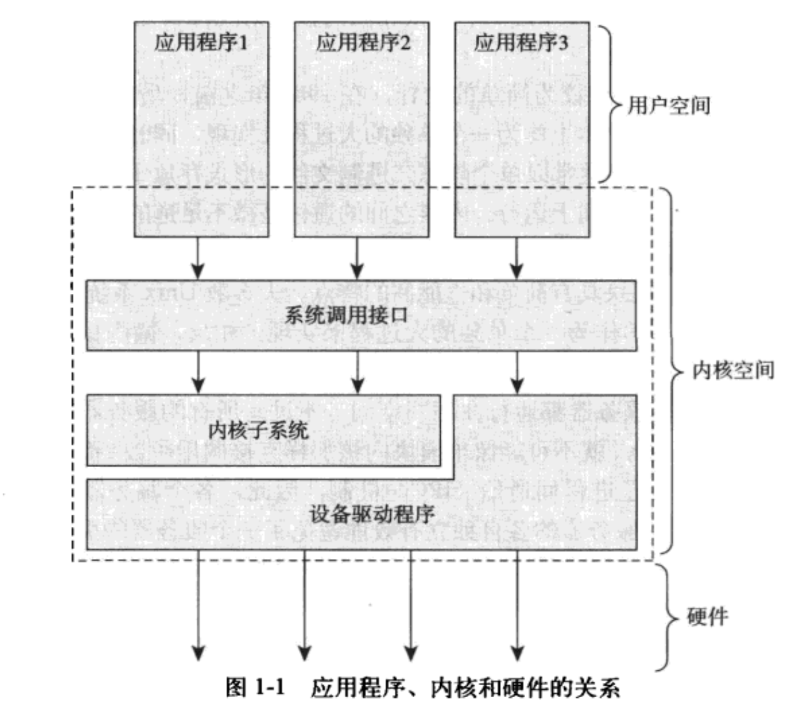

## 目录

[linux kernel](#Linux-kernel )
- [1 kernel 的诞生背景和历史发展](#1-kernel-的诞生背景和历史发展)
- [2 kernel 的架构设计和模块分层](#2-kernel-的架构设计和模块分层)
- [3 Linux 驱动在内核中的位置](#3-Linux-驱动在内核中的位置)

[Andriod 架构](#Andriod-架构)

- [1 Andriod 架构设计](#1-Andriod-架构设计)
- [2 Andriod 和 linux 的关系](#2-Andriod-和-linux-的关系)


# Linux kernel 

## 1 kernel 的诞生背景和历史发展

#### **1. 诞生背景**
- 计算机操作系统发展初期，各种系统缺乏统一标准，用户容易混淆操作系统与应用程序。
- 操作系统的核心部分是 **内核（Kernel）**，它负责**管理硬件资源、进程调度、内存管理、设备驱动、进程间通信**等关键任务。
- 内核运行在**内核态（Kernel Mode）**，而应用程序运行在**用户态（User Mode）**，两者通过**系统调用（System Call）**进行交互。
- Unix 作为早期操作系统，奠定了现代内核的基础，许多操作系统都采用了类似的设计思想。

#### **2. 内核的主要类别**
- **单内核（Monolithic Kernel）**：整个内核作为一个大模块运行在内核空间，所有内核服务直接调用，性能较高（如 Linux）。
- **微内核（Microkernel）**：将内核功能拆分为多个服务器模块，大部分运行在用户空间，通过**消息传递（IPC）**进行通信（如 Mach、Windows NT）。
- **混合内核（Hybrid Kernel）**：结合单内核和微内核的优点，提高性能（如 Windows 7、macOS）。

#### **3. Unix 时代（1960s-1980s）**
- 1969 年，AT&T 贝尔实验室的 Ken Thompson 和 Dennis Ritchie 开发了 Unix 操作系统，采用单内核架构。
- Unix 发展迅速，形成多个变种，如 BSD、System V，各种版本的 Unix 内核仍然以单内核为主。

#### **4. Linux 时代（1991 至今）**
- 1991 年，Linus Torvalds 受到 Unix 影响，开发了**Linux 内核**，并采用 GPL 开源协议，吸引全球开发者参与。
- Linux 采用 **模块化单内核** 设计，支持 **动态加载内核模块**，避免了传统 Unix 的静态编译问题。
- 逐步支持 **对称多处理（SMP）**、**内核抢占（Preemptive Kernel）**、**热插拔设备** 等现代特性，使其适用于服务器、嵌入式、移动设备等多个领域。

#### **5. Linux 内核的发展**
- **早期（1.x - 2.4）**：支持基础功能，主要用于服务器。
- **现代（2.6 之后）**：
  - 引入 **动态模块加载**，支持**内核线程**，提升多任务能力。
  - 采用 **抢占式调度**，减少高优先级任务的延迟，提高实时性能。
  - 引入 **sysfs 文件系统**，优化设备管理。
- **当前（5.x+）**：
  - 提供更好的 **容器支持（cgroups, namespaces）**。
  - 支持 **BPF 技术**，提升内核性能和安全性。
  - 持续优化 **电源管理、调度器、文件系统** 等组件。

#### **6. 版本管理**
- **奇数版本（如 2.5, 2.7）**：开发版，不稳定。
- **偶数版本（如 2.6, 3.0, 4.0）**：稳定版，适用于生产环境。
- **当前采用长期支持（LTS）和滚动发布**，如 5.x 仍在不断演进。


## 2 kernel 的架构设计和模块分层


#### 1. Linux 内核源码树

内核源码树由多个目录组成，每个目录负责不同的功能，下面总结了源码树的主要目录结构：
##### 主要目录结构：

| 目录名     | 描述 |
|------------|------------------------------------------------|
| `arch`      | 体系结构相关的源代码（不同 CPU 架构的代码） |
| `block`     | 块设备 I/O 层 |
| `crypto`    | 加密 API |
| `Documentation` | 内核源码文档 |
| `drivers`   | 设备驱动程序 |
| `firmware`  | 设备驱动所需的固件 |
| `fs`        | VFS（虚拟文件系统）及各种文件系统 |
| `include`   | 内核头文件 |
| `init`      | 内核引导和初始化代码 |
| `ipc`       | 进程间通信（IPC）代码 |
| `kernel`    | 核心子系统，如进程调度器 |
| `lib`       | 通用内核函数库 |
| `mm`        | 内存管理子系统（包含虚拟内存管理） |
| `net`       | 网络协议栈及相关网络代码 |
| `samples`   | 示例代码，演示内核 API 的使用 |
| `scripts`   | 内核编译和构建过程中使用的脚本 |
| `security`  | Linux 安全模块（LSM） |
| `sound`     | 音频子系统 |
| `usr`       | 早期用户空间代码（如 `initramfs`） |
| `tools`     | 内核开发相关的工具 |
| `virt`      | 虚拟化相关代码（如 KVM） |

##### 说明
- `arch/` 目录下包含 **不同 CPU 体系结构** 的内核代码，如 `x86/`、`arm/`、`riscv/` 等。
- `drivers/` 包含 **各类设备驱动**，如 `gpu/`、`usb/`、`input/` 等。
- `net/` 目录涉及 **网络协议栈**，如 TCP/IP、无线网络（Wi-Fi）、蓝牙等。
- `security/` 目录包含 **SELinux、AppArmor 等安全模块** 的代码。

#### 2. Linux 内核架构
Linux 内核的架构是一种 **模块化设计**，可以动态加载和卸载驱动，同时具有强大的 **进程管理**、**内存管理** 和 **文件系统管理** 功能。它将 **用户空间** 和 **内核空间** 分开，使得应用程序无法直接访问硬件，提高安全性和稳定性。

**以下是 Linux 内核的基本架构图及其详细说明。**

```plaintext
+----------------------------------------------------------+
|                     User Space（用户空间）                 |
| +------------------+   +------------------+              |
| | 用户进程 (App)   |   |  Shell (Bash)    |               |
| +------------------+   +------------------+              |
|                 glibc（用户态C库）                         |
+----------------------------------------------------------+
|                    Kernel Space（内核空间）                |
| +-----------------------------------------------------+  |
| |         System Call Interface（系统调用接口）          | |
| +-----------------------------------------------------+  |
| | Process Scheduler  | Memory Management              |  |
| | (进程调度)          | (内存管理)                       | |
| +-----------------------------------------------------+  |
| | File System       | Network Stack                   |  |
| | (文件系统)         | (网络协议栈)                      |  |
| +-----------------------------------------------------+  |
| | Drivers (设备驱动)                                   |  |
| +-----------------------------------------------------+  |
| | Hardware Abstraction Layer (HAL)  （硬件抽象层）      |  |
| +-----------------------------------------------------+  |
|                    硬件（Hardware）                    |   |
+----------------------------------------------------------+
```

##### **各层组件详细介绍**

1. **用户空间（User Space）**
    
    - 运行在用户态的应用程序，如 Bash 终端、浏览器、文本编辑器等。
    - **glibc**（GNU C Library）：为用户程序提供标准库，封装了底层系统调用。
2. **系统调用接口（System Call Interface, SCI）**
    
    - 用户空间访问内核的唯一途径，提供 API，如 `open()`, `read()`, `write()`, `fork()` 等。
    - 应用程序通过 glibc 访问系统调用，最终由 CPU 切换到内核态。
3. **进程调度（Process Scheduler）**
    
    - 负责 CPU 任务分配，管理进程的运行、阻塞、等待等状态。
    - 常见调度策略：CFS（完全公平调度器），实时调度（RT）。
4. **内存管理（Memory Management）**
    
    - 负责管理 RAM，包括：
        - 虚拟内存（Virtual Memory）
        - 物理内存（Physical Memory）
        - 进程地址空间（Address Space）
        - 交换空间（Swap）
5. **文件系统（File System）**
    
    - 提供对存储设备（HDD, SSD）访问的抽象层。
    - 支持不同的文件系统类型，如：
        - ext4、XFS、Btrfs（Linux 常用）
        - NTFS（Windows）
        - NFS（网络文件系统）
6. **网络协议栈（Network Stack）**
    
    - 负责处理 TCP/IP 网络通信，包括：
        - 以太网驱动（Ethernet Driver）
        - 传输层（TCP, UDP）
        - 应用层协议（HTTP, FTP）
7. **设备驱动（Drivers）**
    
    - 连接操作系统和硬件的中间层，如：
        - 存储设备（HDD, SSD）
        - 网络适配器（NIC）
        - 显示设备（GPU）
8. **硬件抽象层（HAL, Hardware Abstraction Layer）**
    
    - 提供标准化接口，使操作系统不必直接与硬件交互。
    - 例如，Linux 可以运行在 x86、ARM、RISC-V 等不同架构上，依赖 HAL 实现硬件兼容性。
9. **硬件层（Hardware）**
    
    - 计算机实际运行的物理组件，如：
        - CPU
        - 内存（RAM）
        - 存储设备
        - I/O 设备（键盘、鼠标、网卡）


##### **内核空间与用户空间**
在 Linux 操作系统中，**用户空间** 和 **内核空间** 通过 **系统调用（System Call）** 进行交互，用户通过内核提供的接口来完成各种系统级操作，这就是 **系统编程** 的核心概念。

**系统调用（System Call）** 是应用程序与操作系统交互的主要方式，Linux 内核提供了大量系统调用函数，使用户程序能够请求内核执行特定任务，例如文件操作、进程管理、网络通信等。调用方式主要有以下三种：

1. **通过 Shell 命令**  
    直接在终端运行系统提供的命令（如 `ls`、`cat` 等），这些命令底层依赖系统调用来完成任务。
    
2. **通过 C 库（glibc）封装的库函数**  
    标准 C 语言库（如 `fopen()`、`read()`、`write()`）对系统调用进行了封装，开发者可以直接使用这些高级 API，而不必直接与内核交互。
    
3. **直接调用系统调用（syscall）**  
    在某些情况下，程序可以绕过 C 库，使用 `syscall()` 直接调用系统调用，或者通过汇编（`asm`）指令与内核交互，这通常用于底层开发或特殊场景。
    


## 3 Linux 驱动在内核中的位置
Linux **驱动（Driver）** 是一类特殊的软件，它运行在 **内核空间（Kernel Space）**，负责管理和控制硬件设备，

**驱动程序（Drivers）** 直接与 **硬件抽象层（HAL）** 交互，它屏蔽了硬件的复杂性，并向上提供标准化的接口，使用户空间的应用程序能够通过系统调用访问硬件。



##### **Linux 驱动的作用**

1. **管理硬件设备**：提供标准接口，让应用程序能够通过系统调用与硬件交互。
2. **屏蔽硬件细节**：不同厂商的设备硬件实现可能不同，驱动提供统一的接口，使上层应用不必关心底层实现。
3. **提升系统稳定性和性能**：操作系统通过驱动管理硬件，避免应用程序直接操作硬件可能带来的不稳定性或安全风险。部分驱动程序包含优化算法，能充分利用硬件加速能力，提高系统整体运行效率。

#### **Linux 驱动的分类**

Linux 驱动主要分为以下几类：

##### **1. 字符设备驱动（Character Device Driver）**

- 以 **字符流** 方式访问数据，每次读写数据都是一个字符或字节流。

- 典型的字符设备驱动：串口驱动（Serial Drivers）、LED、LCD 屏幕驱动、触摸屏驱动

##### **2. 块设备驱动（Block Device Driver）**

- 以 **数据块（Block）** 方式访问数据，支持缓冲区（buffer）。
    
- 主要用于存储设备，如：硬盘 `/dev/sda`、U 盘 `/dev/sdb`、SSD `/dev/nvme0n1`


##### **3. 网络设备驱动（Network Device Driver）**

- 负责处理 **数据包（Packet）** 传输。
- 设备通常不在 `/dev` 目录，而是在 **内核网络栈** 中注册。
- 典型的网络设备驱动：以太网驱动（Ethernet Driver）、Wi-Fi 驱动（Wi-Fi Driver）、蓝牙驱动（Bluetooth Driver）

##### **4. 设备总线驱动（Bus Driver）**

- 负责管理 **总线（Bus）** 设备，如 USB、I²C、SPI、PCI。
- 允许多个设备挂载在总线上，并通过 **驱动与设备匹配机制（Device Matching）** 进行识别和管理。

##### **5. 虚拟设备驱动（Virtual Device Driver）**

- 不对应真实的硬件，而是用于模拟设备或优化系统。
- 典型的虚拟设备驱动：- `loop` 设备（将文件当作磁盘使用）、- `ramdisk`（将内存当作磁盘）、- `/dev/null`（空设备）


#### **Linux 设备驱动的基本架构**

Linux 设备驱动通常包括以下组件：

1. **设备注册与注销**
    
    - `register_chrdev()` / `unregister_chrdev()`（字符设备）
    - `register_blkdev()` / `unregister_blkdev()`（块设备）
    - `register_netdev()` / `unregister_netdev()`（网络设备）
2. **文件操作接口**
    
    - `open()` / `close()`：打开和关闭设备
    - `read()` / `write()`：读写数据
    - `ioctl()`：设备控制命令
    - `poll()` / `select()`：I/O 事件监听
3. **中断处理**
    
    - `request_irq()` / `free_irq()`：注册和释放中断
    - `irq_handler_t`：定义中断处理函数
4. **DMA 传输**
    
    - `dma_alloc_coherent()` / `dma_free_coherent()`：分配和释放 DMA 缓冲区
5. **电源管理**
    
    - `pm_runtime_get()` / `pm_runtime_put()`：管理设备的功耗
    - 
# Andriod 架构

## 1 Andriod 架构设计

Android 是基于 Linux 内核（Linux Kernel）的移动操作系统，但它在 Linux 基础上做了大量修改，以适应移动设备的需求。以下是 Android 的整体架构图。
```
+---------------------------------------------------------+
|                      应用层（Application）                |
|---------------------------------------------------------|
|        系统应用 (Settings, Camera, Phone, etc.)           |
|        第三方应用（微信、抖音、浏览器等）                     |
+---------------------------------------------------------+
|                应用框架层（Application Framework）         |
|---------------------------------------------------------|
|  Activity Manager  |  Window Manager  |   Content Provider|
|  Package Manager   |  Telephony       |   Location Manager|
|  Resource Manager  |  Notification    |   View System    |
+---------------------------------------------------------+
|                 原生库（Native Libraries）                |
|---------------------------------------------------------|
| OpenGL ES | WebKit  | SQLite  | SSL | Media Framework   |
| Skia (2D) | FreeType | SurfaceFlinger | libjpeg/libpng  |
+---------------------------------------------------------+
|                 Android 运行时（Android Runtime）         |
|---------------------------------------------------------|
|   ART（Android Runtime）  |  bionic（C 运行库）            |
+---------------------------------------------------------+
|           硬件抽象层（HAL, Hardware Abstraction Layer）    |
|---------------------------------------------------------|
|      摄像头 |  传感器  |  显示屏 | 音频 | WiFi | GPS        |
+---------------------------------------------------------+
|                Linux 内核（Linux Kernel）                |
|---------------------------------------------------------|
|  进程管理 |  内存管理  |  设备驱动  |  文件系统  |  安全机制   |
|  Binder（IPC） |  网络协议栈  |  电源管理  |  其他系统服务    |
+---------------------------------------------------------+
```

#### **Android 各层详细解析**

#### **(1) 应用层（Application Layer）**

- 直接面向用户的 Android App，如微信、抖音、浏览器等。
- 系统应用（System Apps）也属于这一层，如 **拨号、相机、设置（Settings）**。

#### **(2) 应用框架层（Application Framework）**

- 提供 **Android API**，供开发者调用，所有 App 通过此框架访问系统功能。
- 主要模块：
    - **Activity Manager**：管理应用生命周期。
    - **Window Manager**：管理窗口和 UI 组件。
    - **Content Provider**：实现数据共享（如联系人、日历）。
    - **Package Manager**：管理已安装的应用程序。
    - **Notification Manager**：处理通知。

#### **(3) 原生库（Native Libraries）**

- 主要包含 C/C++ 编写的库，用于底层功能支持：
    - **OpenGL ES**（3D 渲染）
    - **SQLite**（轻量级数据库）
    - **Media Framework**（音视频解码，如 H.264）
    - **WebKit**（浏览器内核）
    - **Skia**（2D 图形绘制）

#### **(4) Android 运行时（Android Runtime, ART）**

- 负责 **Java** 应用的运行。
- **ART（Android Runtime）** 替代了早期的 Dalvik 虚拟机，提高了运行效率。
- **bionic（C 运行库）** 取代了标准的 GNU C 库（glibc），优化了性能和内存占用。

#### **(5) 硬件抽象层（HAL, Hardware Abstraction Layer）**

- 让 Android 代码可以调用底层硬件，如摄像头、音频、GPS 等。
- **厂商（如高通、联发科）** 需要实现 HAL 来支持 Android 访问自家芯片。

#### **(6) Linux 内核（Linux Kernel）**

- **Android 的底层核心**，提供：
    - **进程管理**
    - **内存管理**
    - **文件系统**
    - **驱动支持**
    - **Binder（进程间通信 IPC）**
    - **电源管理**
- **修改的地方**
    - Android 内核不同于标准 Linux 内核，增加了：
        - **Binder IPC**（进程间通信机制）
        - **Wakelock**（电源管理）
        - **Android 内存管理优化**
    - Android 使用 **bionic** 代替标准 **glibc**，更适合移动设备。

## 2 Andriod 和 linux 的关系
- **Android 内核** 基于 Linux，但做了大量修改。
- **Android 使用 Linux 内核进行底层管理**，但应用层和框架层完全不同。
- **Android 设备厂商需要修改 HAL** 以支持不同的硬件，如高通、联发科、三星的芯片。
- **Linux 内核的进程管理、内存管理、驱动支持** 是 Android 运行的基础。


|**功能**|**Android（修改后）**|**标准 Linux**|
|---|---|---|
|**进程管理**|依赖 Linux 内核|使用标准的 Linux 进程管理|
|**内存管理**|增加 LMK（Low Memory Killer）|标准 Linux OOM 处理机制|
|**IPC（进程间通信）**|**使用 Binder**（Android 特色）|**使用 System V IPC、Socket**|
|**C 运行库**|**bionic**（轻量级，优化内存）|**glibc**（标准 C 库）|
|**电源管理**|**Wakelock 机制**（防止错误休眠）|传统的 **Linux 电源管理**|
|**文件系统**|支持 ext4、F2FS（优化闪存存储）|主要使用 ext4、XFS|
